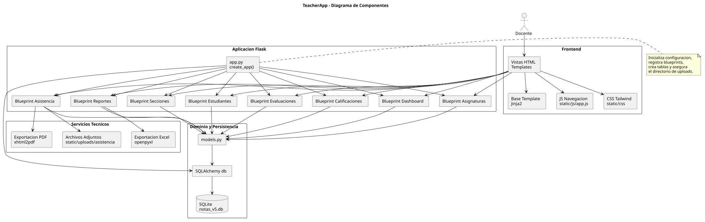
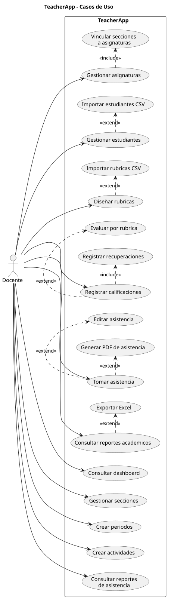
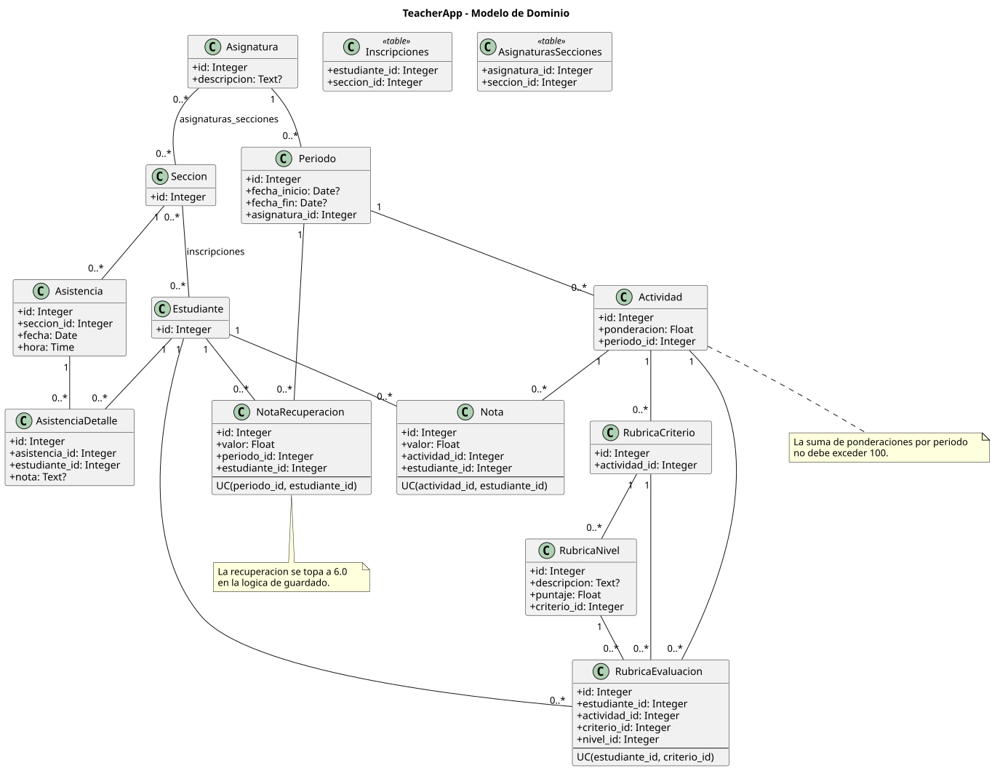
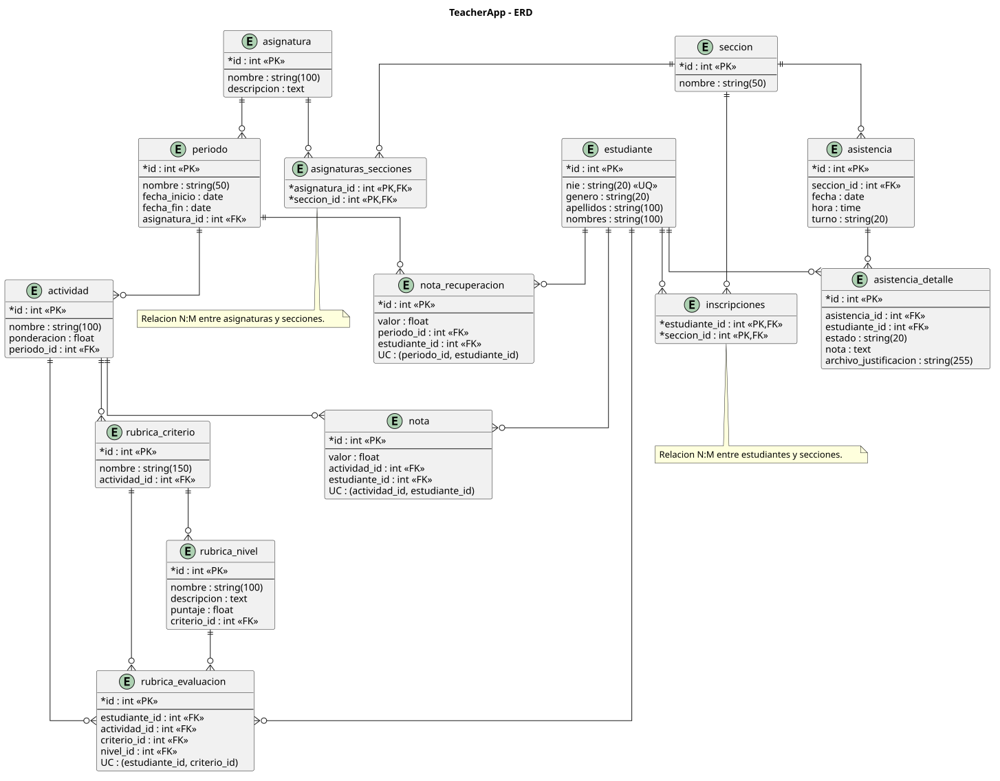
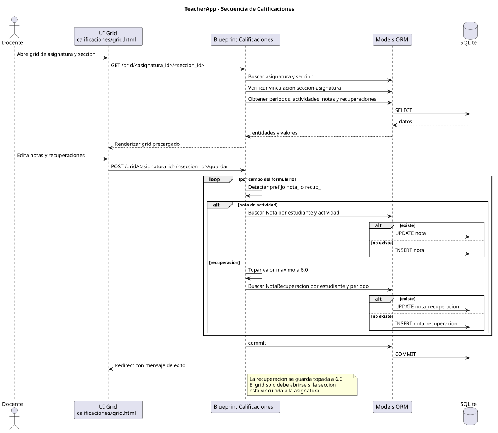
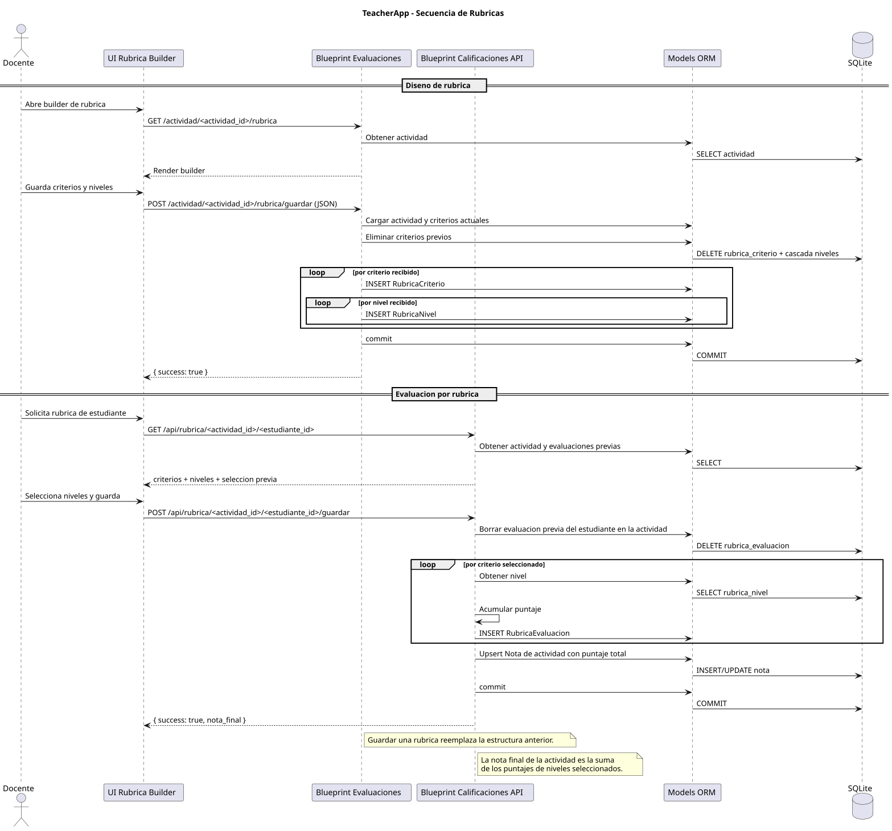
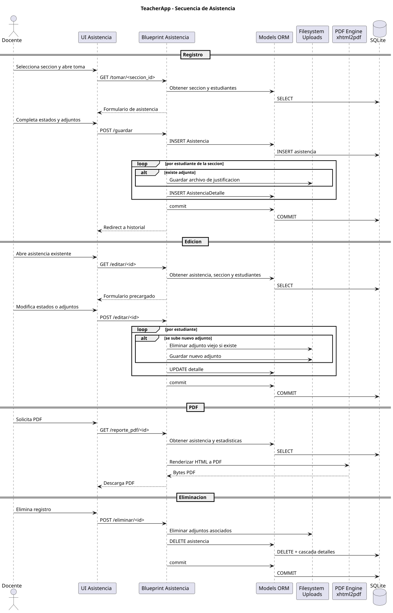
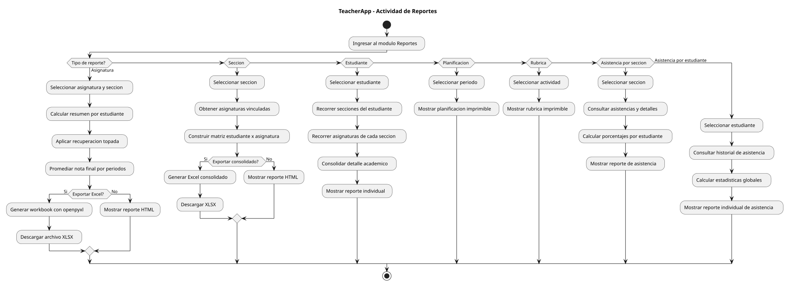

# UML - TeacherApp

Este directorio contiene diagramas PlantUML basados en la implementacion actual de la aplicacion.

## Vista Previa

### Componentes

### Casos de uso

### Modelo de dominio

### ERD

### Flujo de calificaciones

### Flujo de rubricas

### Flujo de asistencia

### Actividad de reportes

## Diagramas Incluidos

1. `componentes.puml`
   Vista de componentes del sistema y sus dependencias.
   Imagen renderizada: `img/componentes.svg`

2. `casos-uso.puml`
   Casos de uso principales del docente.
   Imagen renderizada: `img/casos-uso.svg`

3. `modelo-dominio.puml`
   Diagrama de clases del dominio academico.
   Imagen renderizada: `img/modelo-dominio.svg`

4. `erd.puml`
   Diagrama entidad-relacion con tablas, claves y cardinalidades.
   Imagen renderizada: `img/erd.svg`

5. `flujo-calificaciones.puml`
   Secuencia de trabajo del grid de notas y recuperaciones.
   Imagen renderizada: `img/flujo-calificaciones.svg`

6. `flujo-rubricas.puml`
   Secuencia de diseno y aplicacion de rubricas.
   Imagen renderizada: `img/flujo-rubricas.svg`

7. `flujo-asistencia.puml`
   Secuencia del registro, edicion y exportacion de asistencia.
   Imagen renderizada: `img/flujo-asistencia.svg`

8. `actividad-reportes.puml`
   Flujo de actividad para generacion de reportes.
   Imagen renderizada: `img/actividad-reportes.svg`

## Convenciones

1. Los diagramas reflejan el estado actual del codigo, no una version futura ideal.
2. Los nombres de entidades y modulos respetan la nomenclatura del repositorio.
3. Las reglas de negocio importantes se documentan como notas dentro de los diagramas cuando aplica.
